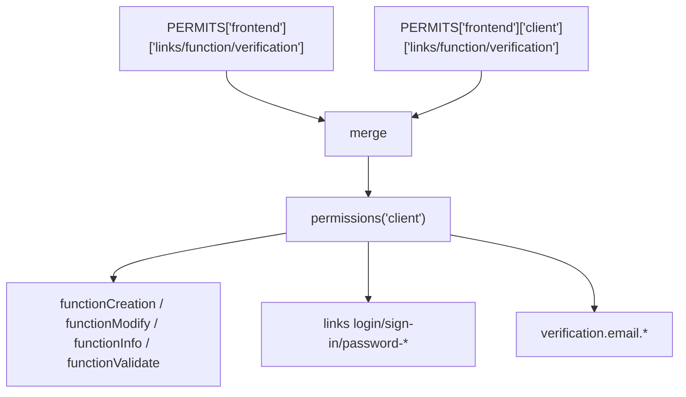
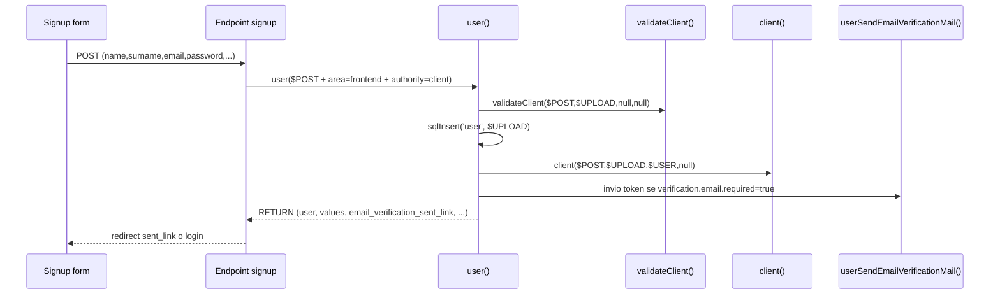
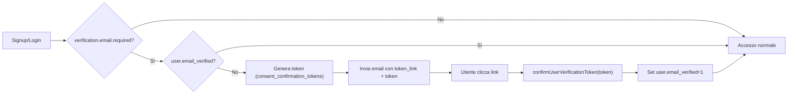

# Permessi client e verifica email

Guida pratica per:

- creare un utente frontend con permesso `client`
- collegare gli hook `validateClient`, `client`, `infoClient`
- attivare e gestire la verifica email

## Riferimenti codice

- `1.5.0/config/app/permission.php`
- `1.5.0/function/user/permission.php`
- `1.5.0/function/user/user.php`
- `1.5.0/function/user/auth.php`
- `1.5.0/function/user/email_verification.php`

## 1) Configurare il permesso `frontend.client`

I permessi custom vengono caricati da `custom/config/permissions.php` e fusi in `$PERMITS`.

Esempio completo:

```php
<?php

$CUSTOM_PERMITS = [
    "frontend" => [
        "client" => [
            "name" => "Cliente",
            "icon" => "<i class='bi bi-person'></i>",
            "bg" => "bg-info",
            "tx" => "text-white",
            "color" => "info",
            "creator" => [ "admin", "administrator" ],
            "links" => [
                "login" => "$PATH->site/account/auth/login/",
                "sign-in" => "$PATH->site/account/auth/sign-in/request/",
                "password-restore" => "$PATH->site/account/auth/password/restore/",
                "password-recovery" => "$PATH->site/account/auth/password/recovery/",
                "password-set" => "$PATH->site/account/auth/password/set/"
            ],
            "function" => [
                "creation" => "client",
                "modify" => "client",
                "info" => "infoClient",
                "validate" => "validateClient"
            ],
            "verification" => [
                "email" => [
                    "required" => true,
                    "token_link" => "$PATH->site/account/auth/email-verification/verify/",
                    "sent_link" => "$PATH->site/account/auth/email-verification/send/",
                    "ttl_hours" => 24
                ]
            ]
        ]
    ]
];
```

Note rapide:

- le chiavi riservate sono `links`, `function`, `verification` (non sono permessi utente)
- una voce è trattata come permesso se è un array e ha almeno `name`
- `verification.email.required=true` abilita il blocco login finché `email_verified=0`

### Merge interno (area + permesso)



## 2) Firma funzioni `validateClient` e `client`

`user()` chiama gli hook con questa firma:

```php
validateClient($POST, $UPLOAD, $USER, $MODIFY_ID);
client($POST, $UPLOAD, $USER, $MODIFY_ID);
infoClient($value, $filter = 'user_id');
```

Parametri:

- `$POST`: payload originale form/request
- `$UPLOAD`: payload già normalizzato per tabella `user`
- `$USER`:
  - `null` in validazione durante creazione
  - oggetto utente (`infoUser`) negli hook `client(...)`
- `$MODIFY_ID`: `null` in creazione, id utente in modifica

Contratti:

- `validateClient(...)`:
  - se c’è errore, imposta `$ALERT`
  - può restituire `->post` per aggiungere/correggere campi prima degli hook
- `client(...)`:
  - deve restituire oggetto con `->values` e `->user`
- `infoClient(...)`:
  - viene chiamata da `infoUser()` per arricchire `$USER->client`

## 3) Esempio `validateClient`

File suggerito: `custom/function/user/client.php` (incluso da `custom/function/function.php`).

```php
<?php

function validateClient($POST, $UPLOAD, $USER = null, $MODIFY_ID = null)
{
    global $ALERT;

    $RETURN = (object) [
        'post' => []
    ];

    // 1) Email valida obbligatoria
    if (empty($UPLOAD['email']) || !filter_var($UPLOAD['email'], FILTER_VALIDATE_EMAIL)) {
        $ALERT = 900;
        return $RETURN;
    }

    // 2) Esempio: dominio consentito
    $allowedDomains = [ 'azienda.it', 'cliente.it' ];
    $domain = strtolower((string) substr(strrchr((string) $UPLOAD['email'], '@'), 1));

    if ($domain === '' || !in_array($domain, $allowedDomains, true)) {
        $ALERT = 900;
        return $RETURN;
    }

    // 3) Normalizzazione valori custom lato POST
    $RETURN->post['newsletter'] = (($POST['newsletter'] ?? 'false') === 'true') ? 'true' : 'false';

    return $RETURN;
}
```

## 4) Esempio `client` e `infoClient`

```php
<?php

function client($POST, $UPLOAD, $USER, $MODIFY_ID = null)
{
    $RETURN = (object) [
        'values' => [],
        'user' => $USER
    ];

    $USER_ID = (int) ($MODIFY_ID ?? ($USER->id ?? 0));
    if ($USER_ID <= 0) {
        return $RETURN;
    }

    $VALUES = [
        'user_id' => $USER_ID,
        'company' => sanitize($POST['company'] ?? ''),
        'vat' => sanitize($POST['vat'] ?? ''),
        'newsletter' => (($POST['newsletter'] ?? 'false') === 'true') ? 'true' : 'false'
    ];

    $EXISTS = sqlSelect('client', [ 'user_id' => $USER_ID ], 1);
    if ($EXISTS->exists) {
        sqlModify('client', $VALUES, 'user_id', $USER_ID);
    } else {
        sqlInsert('client', $VALUES);
    }

    $RETURN->values = $VALUES;
    $RETURN->user = infoUser($USER_ID);

    return $RETURN;
}

function infoClient($value, $filter = 'user_id')
{
    return info('client', $filter, $value);
}
```

## 5) Flusso creazione utente `client`



Comportamenti importanti:

- se `verification.email.required=true` e l’email esiste già, il flusso può riusare l’utente esistente (`already_registered=true`) e reinviare il link
- in modifica utente:
  - `backend`/`api`: una sola authority per area
  - `frontend`: authority multiple consentite

## 6) Endpoint esempi pronti

### Signup

```php
<?php

$POST = array_merge($_POST, [
    'area' => 'frontend',
    'authority' => 'client',
    'active' => 'true'
]);

$RESULT = user($POST, null);

if (!empty($ALERT)) {
    // gestisci errore
    exit;
}

if ($RESULT->email_verification_required) {
    $sent = trim((string) ($RESULT->email_verification_sent_link ?? ''));
    if ($sent !== '') {
        header("Location: $sent");
        exit;
    }
}

header("Location: /account/auth/login/");
exit;
```

### Verifica token email

```php
<?php

$token = $_GET['token'] ?? '';
$result = confirmUserVerificationToken((string) $token);

if ($result->success ?? false) {
    $redirect = trim((string) ($result->redirect_url ?? ''));
    header('Location: '.($redirect !== '' ? $redirect : '/account/auth/login/?alert=920'));
    exit;
}

// Errore: $ALERT valorizzato (es. 918 token non valido, 919 token scaduto)
header('Location: /account/auth/email-verification/send/?alert='.(int) ($ALERT ?? 900));
exit;
```

### Login con permesso `client`

```php
<?php

$ok = authenticateUser(
    'email',
    $_POST['email'] ?? '',
    $_POST['password'] ?? '',
    'frontend',
    [ 'client' ]
);

if ($ok) {
    header('Location: /account/');
    exit;
}

// Se email non verificata: la funzione invia mail e redireziona a sent_link
```

## 7) Diagramma verifica email



