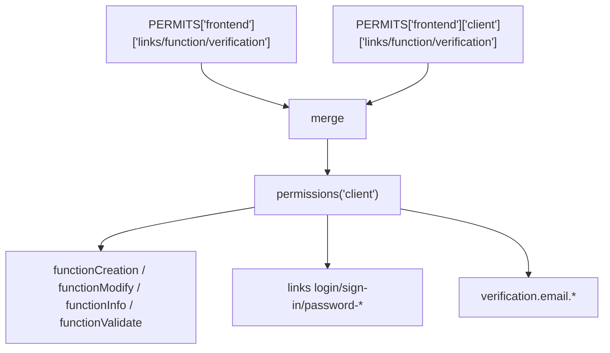
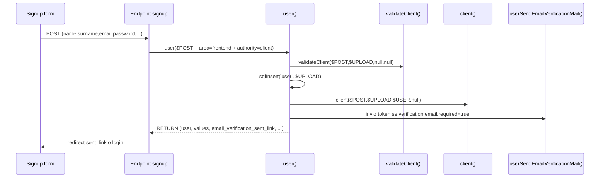
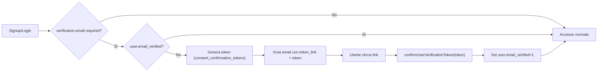

# Permessi client e verifica email

Guida pratica per:

- creare un utente frontend con permesso `client`
- collegare gli hook `validateClient`, `client`, `infoClient`
- attivare e gestire la verifica email

## Riferimenti codice

- `app/config/app/permission.php`
- `class/App/Permission/Area.php`
- `class/App/Permission/Permission.php`
- `class/App/Permission/Permissions.php`
- `class/App/Permission/PermissionRegistry.php`
- `app/function/user/permission.php`
- `app/function/user/user.php`
- `app/function/user/auth.php`
- `app/function/user/email_verification.php`

## 1) Configurare il permesso `frontend.client`

I permessi custom possono essere definiti in `custom/config/permissions.php` usando direttamente la facade `Wonder\App\Permission\Permissions`. Il file viene eseguito dentro il registry gia' attivo, quindi non serve tenere una variabile locale. Il `return` di un array o di una `PermissionRegistry` resta utile come compat legacy in altri punti del framework.

La convenzione consigliata e':

- `Area` per definire le impostazioni globali di area (`links`, `function`, `verification`)
- `Permission` per definire la singola authority utente
- `Permissions` come facade statica per aggregare, mutare e serializzare
- `PermissionRegistry` come motore interno

Esempio completo:

```php
<?php

use Wonder\App\Permission\Area;
use Wonder\App\Permission\Permission;
use Wonder\App\Permission\Permissions;

Permissions::reset()
    ->addArea(Area::make('frontend'))
    ->addPermission(
        Permission::make('client', 'frontend')
            ->name('Cliente')
            ->icon("<i class='bi bi-person'></i>")
            ->bg('bg-info')
            ->tx('text-white')
            ->color('info')
            ->creator(['admin', 'administrator'])
            ->link('login', "$PATH->site/account/auth/login/")
            ->link('sign-in', "$PATH->site/account/auth/sign-in/request/")
            ->link('password-restore', "$PATH->site/account/auth/password/restore/")
            ->link('password-recovery', "$PATH->site/account/auth/password/recovery/")
            ->link('password-set', "$PATH->site/account/auth/password/set/")
            ->function('creation', 'client')
            ->function('modify', 'client')
            ->function('info', 'infoClient')
            ->function('validate', 'validateClient')
            ->verification('email', [
                'required' => true,
                'token_link' => "$PATH->site/account/auth/email-verification/verify/",
                'sent_link' => "$PATH->site/account/auth/email-verification/send/",
                'ttl_hours' => 24,
            ])
    );

Permissions::area('frontend')
    ->route('login', 'frontend.account.login');

Permissions::permission('frontend', 'client')
    ->icon("<i class='bi bi-person-check'></i>");

return Permissions::instance();
```

Nel file `custom/config/permissions.php` puoi anche non restituire nulla:

```php
<?php

use Wonder\App\Permission\Permissions;

Permissions::permission('backend', 'administrator')
    ->route('home', 'backend.custom.home');
```

## 1.1 Ordine Di Precedenza

Il caricamento reale avviene in questo ordine:

1. core `app/config/app/permission.php`
2. moduli abilitati tramite `Module\Registry::mergePermissions(...)`
3. `custom/config/permissions.php`

Quindi la precedenza finale e':

`core < modules < custom`

In pratica:

- `custom` puo' sovrascrivere un valore definito nel core
- `custom` puo' sovrascrivere un valore definito da un modulo
- un permesso puo' sovrascrivere il valore ereditato dalla sua area

## 1.2 Esempi Pratici

### Cambiare la home del backend solo per `administrator`

```php
<?php

use Wonder\App\Permission\Permissions;

Permissions::permission('backend', 'administrator')
    ->route('home', 'backend.custom.home');
```

Effetto:

- `admin` continua a usare `backend.home`
- `administrator` usa `backend.custom.home`

### Cambiare il login di tutta l'area `frontend`

```php
<?php

use Wonder\App\Permission\Permissions;

Permissions::area('frontend')
    ->route('login', 'frontend.account.login');
```

Effetto:

- tutti i permessi `frontend` che non ridefiniscono `login` useranno quel link

### Sovrascrivere un link area solo per `client`

```php
<?php

use Wonder\App\Permission\Permissions;

Permissions::area('frontend')
    ->route('login', 'frontend.account.login');

Permissions::permission('frontend', 'client')
    ->link('login', "$PATH->site/account/auth/login/");
```

Effetto:

- l'area `frontend` usa `frontend.account.login`
- il permesso `client` usa invece il link custom dichiarato sul permesso

### Aggiungere un nuovo permesso e poi modificarlo dopo

```php
<?php

use Wonder\App\Permission\Permission;
use Wonder\App\Permission\Permissions;

Permissions::addPermission(
    Permission::make('editor', 'backend')
        ->name('Editor')
        ->icon("<i class='bi bi-pencil'></i>")
        ->bg('bg-warning')
        ->tx('text-dark')
        ->color('warning')
        ->creator(['admin'])
);

Permissions::permission('backend', 'editor')
    ->route('home', 'backend.editor.home')
    ->function('info', 'infoEditor');
```

Effetto:

- prima registri il permesso
- poi lo riapri e lo completi senza usare variabili locali

### Sovrascrivere un permesso definito da un modulo

Se un modulo registra `blog_editor` nell'area `backend`, in `custom/config/permissions.php` puoi comunque fare:

```php
<?php

use Wonder\App\Permission\Permissions;

Permissions::permission('backend', 'blog_editor')
    ->route('home', 'backend.blog.dashboard')
    ->creator(['admin', 'administrator']);
```

Poiche' `custom` viene eseguito dopo i moduli, questa definizione ha la precedenza finale.

Note rapide:

- le chiavi riservate sono `links`, `function`, `verification` (non sono permessi utente)
- una voce è trattata come permesso se è un array e ha almeno `name`
- `Area::make('frontend')->route(...)->link(...)->function(...)->verification(...)` definisce l'area
- `Permission::make('client', 'frontend')->name(...)->icon(...)->creator(...)` definisce la authority
- `Permissions` e' la facade da usare nel file, senza variabili locali
- dopo `addArea(...)` puoi fare `Permissions::area('frontend')->route(...)`
- dopo `addPermission(...)` puoi fare `Permissions::permission('frontend', 'client')->icon(...)->creator([...])`
- in `custom/config/permissions.php` puoi usare la facade in modo imperativo senza `return`
- `verification.email.required=true` abilita il blocco login finché `email_verified=0`

### Merge interno (area + permesso)



## 2) Firma funzioni `validateClient` e `client`

`user()` chiama gli hook con questa firma:

```php
validateClient($POST, $UPLOAD, $USER, $MODIFY_ID);
client($POST, $UPLOAD, $USER, $MODIFY_ID);
infoClient($value, $filter = 'user_id');
```

Parametri:

- `$POST`: payload originale form/request
- `$UPLOAD`: payload già normalizzato per tabella `user`
- `$USER`:
  - `null` in validazione durante creazione
  - oggetto utente (`infoUser`) negli hook `client(...)`
- `$MODIFY_ID`: `null` in creazione, id utente in modifica

Contratti:

- `validateClient(...)`:
  - se c’è errore, imposta `$ALERT`
  - può restituire `->post` per aggiungere/correggere campi prima degli hook
- `client(...)`:
  - deve restituire oggetto con `->values` e `->user`
- `infoClient(...)`:
  - viene chiamata da `infoUser()` per arricchire `$USER->client`

## 3) Esempio `validateClient`

File suggerito: `custom/function/user/client.php` (incluso da `custom/function/function.php`).

```php
<?php

function validateClient($POST, $UPLOAD, $USER = null, $MODIFY_ID = null)
{
    global $ALERT;

    $RETURN = (object) [
        'post' => []
    ];

    // 1) Email valida obbligatoria
    if (empty($UPLOAD['email']) || !filter_var($UPLOAD['email'], FILTER_VALIDATE_EMAIL)) {
        $ALERT = 900;
        return $RETURN;
    }

    // 2) Esempio: dominio consentito
    $allowedDomains = [ 'azienda.it', 'cliente.it' ];
    $domain = strtolower((string) substr(strrchr((string) $UPLOAD['email'], '@'), 1));

    if ($domain === '' || !in_array($domain, $allowedDomains, true)) {
        $ALERT = 900;
        return $RETURN;
    }

    // 3) Normalizzazione valori custom lato POST
    $RETURN->post['newsletter'] = (($POST['newsletter'] ?? 'false') === 'true') ? 'true' : 'false';

    return $RETURN;
}
```

## 4) Esempio `client` e `infoClient`

```php
<?php

function client($POST, $UPLOAD, $USER, $MODIFY_ID = null)
{
    $RETURN = (object) [
        'values' => [],
        'user' => $USER
    ];

    $USER_ID = (int) ($MODIFY_ID ?? ($USER->id ?? 0));
    if ($USER_ID <= 0) {
        return $RETURN;
    }

    $VALUES = [
        'user_id' => $USER_ID,
        'company' => sanitize($POST['company'] ?? ''),
        'vat' => sanitize($POST['vat'] ?? ''),
        'newsletter' => (($POST['newsletter'] ?? 'false') === 'true') ? 'true' : 'false'
    ];

    $EXISTS = sqlSelect('client', [ 'user_id' => $USER_ID ], 1);
    if ($EXISTS->exists) {
        sqlModify('client', $VALUES, 'user_id', $USER_ID);
    } else {
        sqlInsert('client', $VALUES);
    }

    $RETURN->values = $VALUES;
    $RETURN->user = infoUser($USER_ID);

    return $RETURN;
}

function infoClient($value, $filter = 'user_id')
{
    return info('client', $filter, $value);
}
```

## 5) Flusso creazione utente `client`



Comportamenti importanti:

- se `verification.email.required=true` e l’email esiste già, il flusso può riusare l’utente esistente (`already_registered=true`) e reinviare il link
- in modifica utente:
  - `backend`/`api`: una sola authority per area
  - `frontend`: authority multiple consentite

## 6) Endpoint esempi pronti

### Signup

```php
<?php

$POST = array_merge($_POST, [
    'area' => 'frontend',
    'authority' => 'client',
    'active' => 'true'
]);

$RESULT = user($POST, null);

if (!empty($ALERT)) {
    // gestisci errore
    exit;
}

if ($RESULT->email_verification_required) {
    $sent = trim((string) ($RESULT->email_verification_sent_link ?? ''));
    if ($sent !== '') {
        header("Location: $sent");
        exit;
    }
}

header("Location: /account/auth/login/");
exit;
```

### Verifica token email

```php
<?php

$token = $_GET['token'] ?? '';
$result = confirmUserVerificationToken((string) $token);

if ($result->success ?? false) {
    $redirect = trim((string) ($result->redirect_url ?? ''));
    header('Location: '.($redirect !== '' ? $redirect : '/account/auth/login/?alert=920'));
    exit;
}

// Errore: $ALERT valorizzato (es. 918 token non valido, 919 token scaduto)
header('Location: /account/auth/email-verification/send/?alert='.(int) ($ALERT ?? 900));
exit;
```

### Login con permesso `client`

```php
<?php

$ok = authenticateUser(
    'email',
    $_POST['email'] ?? '',
    $_POST['password'] ?? '',
    'frontend',
    [ 'client' ]
);

if ($ok) {
    header('Location: /account/');
    exit;
}

// Se email non verificata: la funzione invia mail e redireziona a sent_link
```

## 7) Diagramma verifica email


